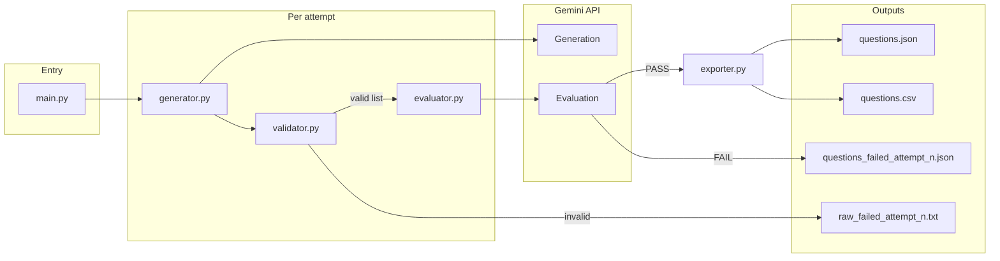

# Agentic Workflow — Phase 1 (MCQ generator)

Small Python pipeline that generates **10 multiple-choice questions** for a given **topic** and **difficulty level** using the **Google Gemini API**, validates structure with code, runs a **second-pass LLM review**, and exports **JSON** and **CSV**.

## What it does

1. **Generate** — `generator.py` calls Gemini with a prompt from `prompts.py` (JSON-only response mode).
2. **Validate** — `validator.py` parses the JSON array with `json.JSONDecoder.raw_decode` (handles `]` inside strings), checks 10 items, required fields, four distinct options, and that `answer` exactly matches one option string.
3. **Evaluate** — `evaluator.py` sends the same batch back to Gemini for a **PASS** / **FAIL** decision (serious issues only: wrong key, ambiguity, wrong level, unreadable text).
4. **Export** — On **PASS**, `exporter.py` writes `questions.json` and `questions.csv`.

Up to **`MAX_RETRIES` (2)** full attempts. If attempt 1 fails evaluation, the failure text is passed into attempt 2 as **`eval_feedback`** (lower temperature on that retry). Failed-eval batches are saved as `questions_failed_attempt_<n>.json` for inspection.

## Architecture

The codebase is a **small linear pipeline** with one orchestrator and clear separation between **LLM calls**, **deterministic validation**, and **file output**.

| Layer | Modules | Responsibility |
|-------|---------|----------------|
| Entry / orchestration | `main.py` | CLI, reads optional sample/reference files, runs the **generate → validate → evaluate** loop up to `MAX_RETRIES`, carries **`eval_feedback`** between attempts, writes `raw_failed_attempt_<n>.txt` when validation fails. |
| Configuration | `config.py` | Loads `.env`, exposes model id, retry count, and temperatures (used by `generator.py` and `evaluator.py`). |
| Generation (LLM) | `generator.py`, `prompts.py` | Builds the user prompt via `build_prompt` in `prompts.py`, calls Gemini with JSON response mode, returns raw model text. |
| Validation (no I/O) | `validator.py` | Extracts and parses the JSON array, enforces schema and consistency rules; returns a Python list of dicts or an error message. |
| Evaluation (LLM) | `evaluator.py` | Sends the validated batch to Gemini with an inline rubric; expects structured JSON with **PASS** / **FAIL** semantics. |
| Export | `exporter.py` | Writes successful batches to `questions.json` and `questions.csv`. |

**Dependency direction:** `main` → `generator`, `validator`, `evaluator`, `exporter`; `generator` → `config`, `prompts`; `evaluator` → `config`. `validator` and `exporter` depend only on the standard library (plus their own logic).



On **FAIL**, `main.py` saves `questions_failed_attempt_<n>.json`, stores a truncated copy of the evaluator message in **`eval_feedback`**, and starts the next attempt (if any). Validation failures skip evaluation and only write **`raw_failed_attempt_<n>.txt`**.

## Requirements

- Python **3.10+** (tested with 3.12)
- A **Google AI (Gemini) API key** with access to the configured model

## Setup

On Debian/Ubuntu-style systems, avoid `pip install` on the system Python (PEP 668). Use a virtual environment:

```bash
cd "/path/to/AgenticWorkflow_Phase_1"
python3 -m venv .venv
source .venv/bin/activate
pip install -r requirements.txt
```

Create a **`.env`** file in the project root (same folder as `config.py`):

```env
GOOGLE_API_KEY=your_key_here
```

`config.py` loads this file explicitly and sets `override=True` so project `.env` wins over stale shell variables.

## Usage

```bash
source .venv/bin/activate
python main.py                          # defaults: topic Probability, level L2
python main.py "Linear Algebra" L3
python main.py Probability L2 \
  --samples "One stem + four full-sentence options per question." \
  --references "Focus on eigenvalues; no coding questions."
python main.py Statistics L2 \
  --samples-file ./notes/examples.txt \
  --references-file ./notes/syllabus.md
python main.py --help
```

Positional arguments: **`topic`**, **`level`**. Optional: **`--samples`**, **`--references`**, or file variants **`--samples-file`**, **`--references-file`** (UTF-8; files override inline strings).

## Configuration (`config.py`)

| Variable | Role |
|----------|------|
| `GEMINI_MODEL` | Model id for generation and evaluation (e.g. `gemini-2.5-flash`). |
| `MAX_RETRIES` | Maximum full generate→validate→evaluate cycles (default **2**). |
| `TEMPERATURE` | Sampling temperature for the first generation attempt. |
| `TEMPERATURE_WITH_FEEDBACK` | Temperature when `eval_feedback` is non-empty (second attempt). |

## Output files

| File | When |
|------|------|
| `questions.json` | Successful run; pretty-printed array of question objects. |
| `questions.csv` | Same batch, tabular form for spreadsheets. |
| `questions_failed_attempt_<n>.json` | That attempt passed validation but **evaluation** returned `FAIL`. |

Each question object includes: `question`, `options` (4 strings), `answer`, `explanation`, `level`, `topic`.

## Project layout

| File | Purpose |
|------|---------|
| `main.py` | CLI, retry loop, wiring samples/references and eval feedback. |
| `config.py` | Env loading, model id, retries, temperatures. |
| `prompts.py` | System/user-style prompt and JSON schema instructions. |
| `generator.py` | Gemini `generate_content` with `response_mime_type=application/json`. |
| `validator.py` | JSON extraction, structural and consistency checks. |
| `evaluator.py` | Second Gemini call; normalized return `PASS` or `FAIL: ...`. |
| `exporter.py` | `questions.json` / `questions.csv` writers. |

## Troubleshooting

- **`ModuleNotFoundError` for `google`**: activate `.venv` and run `pip install -r requirements.txt`.
- **`404` / model not found**: update `GEMINI_MODEL` in `config.py` to a model your key can call (see [Gemini models](https://ai.google.dev/gemini-api/docs/models/gemini)).
- **Validation errors**: the model returned non-JSON or a bad array; logs show attempt number and parse or rule message. Second attempt may include evaluator feedback if attempt 1 failed eval, not validation.
- **`Failed after retries`**: both attempts failed evaluation (or validation twice). Inspect `questions_failed_attempt_*.json` and tighten prompts or evaluator wording as needed.
- **`FutureWarning` from `google.generativeai`**: the SDK package is deprecated in favor of `google.genai`; this project still uses `google-generativeai` until migrated.

## License

Add a license if you distribute this repository.
